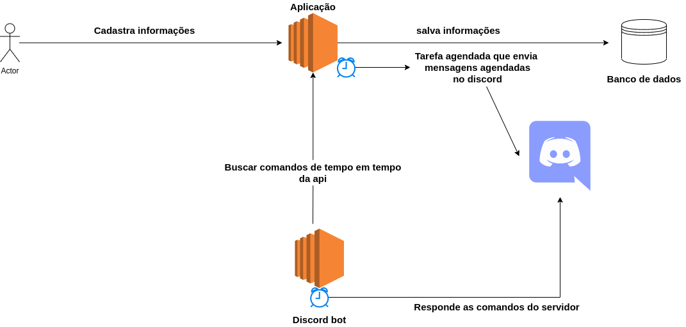

ABOUT PROJECT:
===============

- The project responsable register commands Discord bot and register schedule messages.

FEATURES:
==========

- Create command than will be add command in Discord bot in 1 or 2 minutes after registered 
- Create schedule message than will be trigger at in moment defined when create schedule message. OBS: The schedule messages is triggered behind the cronjob on application
- Register user
- Login 

ARCHITECTURE:
==============

DISCORD BOT:
=============

Link: https://github.com/tiago123456789/bot-discord

